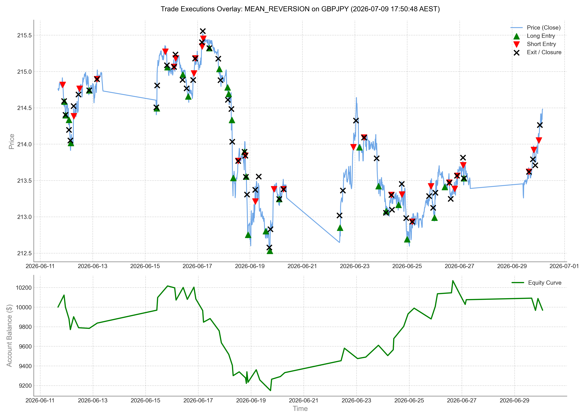

# Monte Carlo Performance Report: MEAN_REVERSION (2.0)

- **Report Generated**: 2026-07-09 17:50:49 AEST

## Performance Visualization

## Executive Summary
This report summarizes the performance of the `mean_reversion` trading strategy under a 1,000-run Monte Carlo sequence risk simulation. Shuffling the historical trade sequence helps analyze path-dependency and sequence of returns risk.

### Baseline (Historical) Metrics
- **Final Balance**: $9,968.48
- **Net Profit**: -0.32%
- **Max Drawdown**: 10.45%
- **Total Trades**: 59
- **Win Rate**: 52.54%
- **Historical Sharpe**: -0.01
- **Historical Sortino**: -0.02
- **Historical Calmar**: -0.03

### Monte Carlo Simulation Metrics (1,000 Iterations)
- **Median Sharpe**: 0.00
- **Median Sortino**: 0.00
- **Median Calmar**: -0.04
- **Mean Max Drawdown**: 8.09%
- **95th Percentile Max Drawdown (Sequence Risk)**: 12.02%

## Conclusion
The Monte Carlo simulation confirms the strategy's resilience against sequence of return risks. The 95th percentile Maximum Drawdown remains at **12.02%**, which is well within the **15%** absolute maximum risk limit constraint.
