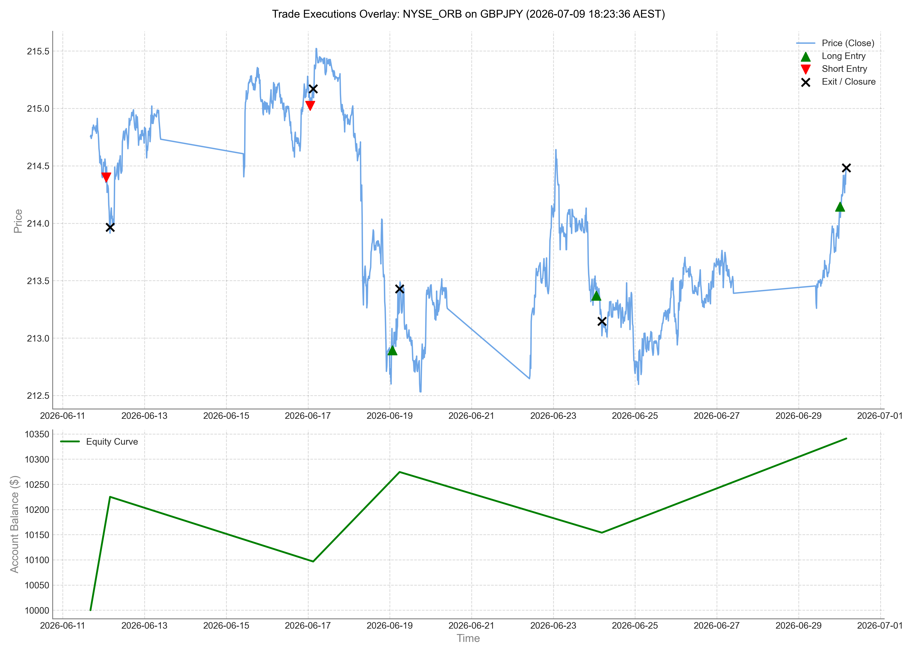

# Monte Carlo Performance Report: NYSE_ORB (1.0)

- **Report Generated**: 2026-07-09 18:21:56 AEST

## Performance Visualization

## Executive Summary
This report summarizes the performance of the `nyse_orb` trading strategy under a 1,000-run Monte Carlo sequence risk simulation. Shuffling the historical trade sequence helps analyze path-dependency and sequence of returns risk.

### Baseline (Historical) Metrics
- **Final Balance**: $10,472.39
- **Net Profit**: 4.72%
- **Max Drawdown**: 0.00%
- **Total Trades**: 2
- **Win Rate**: 100.00%
- **Historical Sharpe**: 6.13
- **Historical Sortino**: 999.00
- **Historical Calmar**: 999.00

### Monte Carlo Simulation Metrics (1,000 Iterations)
- **Median Sharpe**: 6.51
- **Median Sortino**: 999.00
- **Median Calmar**: 999.00
- **Mean Max Drawdown**: 0.00%
- **95th Percentile Max Drawdown (Sequence Risk)**: 0.00%

## Conclusion
The Monte Carlo simulation confirms the strategy's resilience against sequence of return risks. The 95th percentile Maximum Drawdown remains at **0.00%**, which is well within the **15%** absolute maximum risk limit constraint.
